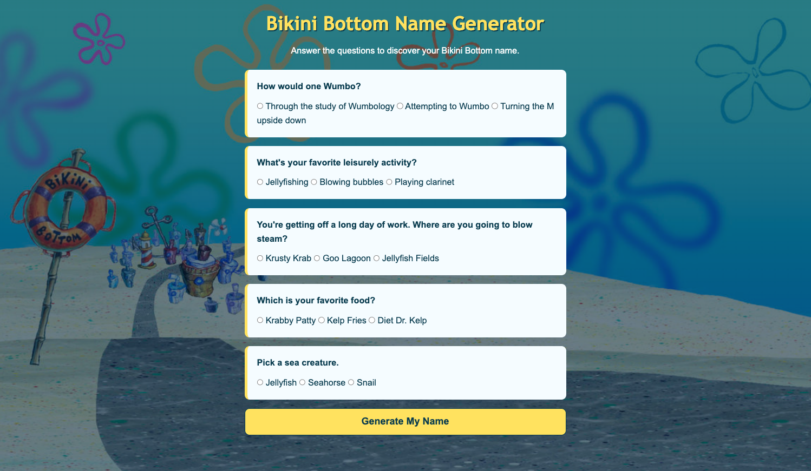

# 🍍 Bikini Bottom Name Generator

Bikini Bottom Name Generator is a fun JavaScript application that generates a random Bikini Bottom-inspired name for the user.

I built this project to practice working with JavaScript functions, arrays, random values, and DOM manipulation while creating a simple interactive experience inspired by the world of SpongeBob SquarePants.

## 📸 Project Preview

## ✨ Features

- Generate a random Bikini Bottom-inspired name
- Display generated results directly on the page
- Generate a new result with each interaction
- Simple, themed user interface

## 🛠️ Built With

- HTML5
- CSS3
- JavaScript

## 🧠 What I Learned

This project helped me strengthen my understanding of:

- Working with JavaScript arrays
- Creating and calling functions
- Generating random values with `Math.random()`
- Using `Math.floor()` to select random array elements
- Working with user interactions
- Selecting and updating DOM elements
- Using event listeners
- Connecting JavaScript logic to an interactive interface

## 🍍 How It Works

The generator uses JavaScript to randomly select values used to create a Bikini Bottom-inspired name.

When the user activates the generator, JavaScript selects the necessary values, combines them into a result, and updates the page with the generated name.

Users can run the generator again to receive a different result.